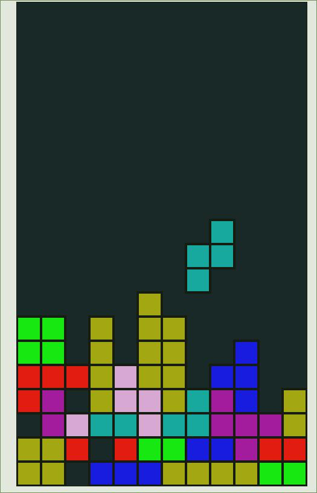

# TetrisPS

Tetris in Purescript using a Canvas

## progress
The basic game is playable but it's lacking:

- [x] Score
- [x] Game-Over detection
- [ ] speed up during gameplay
- [ ] way to restart the game
- [ ] maybe the bouncing of the wall behavior when rotating near obstacles (right now tetrominos won't rotate when they end up in invalid places)

## Build

Assuming you have **Purescript**, **bower** and **pulp** installed

- Clone the repository
- `cd` into the folder
- install dependencies with `bower install`
- build the JavaScript `pulp build -O --to ./dist/tetris.js`
- open `./html/index.html` into your browser (for example `chromium-browser ./html/index.html`)
- **have fun**

## Controls
it's played using the arrow keys on:

- left-/right-arrow to move left/right
- down-arrow to descend faster (one step per key-down)
- up-arrow to rotate the tetromino by 90° clockwise
